  

<picture>
  <source media="(prefers-color-scheme: dark)" srcset="assets/banner-dark.svg">
  <source media="(prefers-color-scheme: light)" srcset="assets/banner-light.svg">
  
</picture>

<picture>
  <source media="(prefers-color-scheme: dark)" srcset="assets/strip-dark.svg">
  <source media="(prefers-color-scheme: light)" srcset="assets/strip-light.svg">
  
</picture>

### Full-stack engineer building with AI agents.

Clean architecture · Fast systems · Production-ready cloud

   

<picture>
  <source media="(prefers-color-scheme: dark)" srcset="assets/divider-dark.svg">
  <source media="(prefers-color-scheme: light)" srcset="assets/divider-light.svg">
  
</picture>

## ⚡ What I do

<picture>
  <source media="(prefers-color-scheme: dark)" srcset="assets/cards-dark.svg">
  <source media="(prefers-color-scheme: light)" srcset="assets/cards-light.svg">
  
</picture>

## 🧰 Toolbox

  <picture>
    <source media="(prefers-color-scheme: light)" srcset="https://skillicons.dev/icons?i=ts,js,java,spring,nodejs,vue,mysql,mongodb,aws,docker,githubactions,jest,vite,linux,neovim,figma&perline=8&theme=light">
    
  </picture>

## 🧭 How I work

- **Boundaries first** — business logic stays independent from frameworks and infrastructure.
- **Tested by default** — small, reusable units with meaningful tests on every layer.
- **Readable over clever** — predictable code, meaningful reviews and technical documentation.
- **AI as a tool** — I direct, AI executes. Every change is understood, reviewed and tested.

## 🧬 Journey

> Every developer starts somewhere. My earlier work lives under the [`legacy`](https://github.com/elvinlab?tab=repositories&q=topic%3Alegacy) topic.

<picture>
  <source media="(prefers-color-scheme: dark)" srcset="assets/timeline-dark.svg">
  <source media="(prefers-color-scheme: light)" srcset="assets/timeline-light.svg">
  
</picture>

<!-- Re-enable once the contribution graph shows real activity.
## 📈 Activity

<picture>
  <source media="(prefers-color-scheme: dark)" srcset="https://raw.githubusercontent.com/elvinlab/elvinlab/output/snake-dark.svg">
  <source media="(prefers-color-scheme: light)" srcset="https://raw.githubusercontent.com/elvinlab/elvinlab/output/snake-light.svg">
  
</picture>
-->

<picture>
  <source media="(prefers-color-scheme: dark)" srcset="assets/divider-dark.svg">
  <source media="(prefers-color-scheme: light)" srcset="assets/divider-light.svg">
  
</picture>

### 🤝 Let's build something

Open to conversations about AI agents, software architecture and interesting engineering challenges.

  

 

🐧 **Terminal-first · Linux · Neovim · Tmux · Zellij**

*"Talk is cheap. Show me the code."*

From the '90s web to the AI era — built with focus, caffeine and Linux.

 &nbsp;  &nbsp; 
 
  

