  

<picture>
  <source media="(prefers-color-scheme: dark)" srcset="assets/header-dark.svg">
  <source media="(prefers-color-scheme: light)" srcset="assets/header-light.svg">
  
</picture>

### Full-stack engineer building with AI agents — clean architecture, fast systems and production-ready cloud.

   

    

<picture>
  <source media="(prefers-color-scheme: dark)" srcset="assets/divider-dark.svg">
  <source media="(prefers-color-scheme: light)" srcset="assets/divider-light.svg">
  
</picture>

## ⚡ What I do

<table>
  <tr>
    <td width="50%" valign="top">
      <h3>🤖 AI Agents &amp; Workflows</h3>
      Multi-agent orchestration, model routing across providers, persistent memory and spec-driven development with Claude Code and OpenCode.
    </td>
    <td width="50%" valign="top">
      <h3>🏗 Software Architecture</h3>
      Clean, hexagonal, vertical slice and screaming architecture. Clear boundaries and predictable code that is easy to evolve.
    </td>
  </tr>
  <tr>
    <td width="50%" valign="top">
      <h3>🌐 Full-Stack Engineering</h3>
      Framework-agnostic: component-driven frontends, REST APIs and data layers — Vue, Java/Spring Boot, Node.js, MySQL and MongoDB.
    </td>
    <td width="50%" valign="top">
      <h3>⚡ Performance &amp; Cloud</h3>
      Profiling and optimization, deployed on AWS — ECS, Fargate, Lambda, API Gateway and CloudFront — with Docker and CI/CD.
    </td>
  </tr>
</table>

## 🧠 Stack

  <picture>
    <source media="(prefers-color-scheme: light)" srcset="https://skillicons.dev/icons?i=ts,js,java,spring,nodejs,vue,mysql,mongodb,aws,docker,githubactions,jest,vite,linux,neovim,figma&perline=8&theme=light">
    
  </picture>

## 🧭 How I work

- **Boundaries first** — business logic stays independent from frameworks and infrastructure.
- **Tested by default** — small, reusable units with meaningful tests on every layer.
- **Readable over clever** — predictable code, meaningful reviews and technical documentation.
- **AI as a tool** — I direct, AI executes. Every change is understood, reviewed and tested.

## 🛰 Now

- 🚧 Rebuilding [elvinlab.dev](https://elvinlab.dev) as a blog about AI agents, architecture and performance.
- 🤖 Designing agentic development workflows: orchestration, model routing and memory.
- 🔜 New projects on the way — they will be pinned right here.

## 🧬 Journey

> Every developer starts somewhere. My earlier work lives under the [`legacy`](https://github.com/elvinlab?tab=repositories&q=topic%3Alegacy) topic.

| Year | Milestone |
|:----:|-----------|
| **2020** | First APIs and university projects with Node.js, Laravel and Angular |
| **2021** | Team projects with React and Next.js |
| **2022–2024** | Full-stack products, Vue, Java/Spring Boot and AWS |
| **2025 → today** | AI agents and workflows, clean architecture and performance |

<!-- Re-enable once the contribution graph shows real activity.
## 📈 Activity

<picture>
  <source media="(prefers-color-scheme: dark)" srcset="https://raw.githubusercontent.com/elvinlab/elvinlab/output/snake-dark.svg">
  <source media="(prefers-color-scheme: light)" srcset="https://raw.githubusercontent.com/elvinlab/elvinlab/output/snake-light.svg">
  
</picture>
-->

<picture>
  <source media="(prefers-color-scheme: dark)" srcset="assets/divider-dark.svg">
  <source media="(prefers-color-scheme: light)" srcset="assets/divider-light.svg">
  
</picture>

### 🤝 Let's build something

Open to conversations about AI agents, software architecture and interesting engineering challenges.

  

 

🐧 **Terminal-first · Linux · Neovim · Tmux · Zellij**

*"Talk is cheap. Show me the code."*

From the '90s web to the AI era — built with focus, caffeine and Linux.

 &nbsp;  &nbsp; 
 
  

